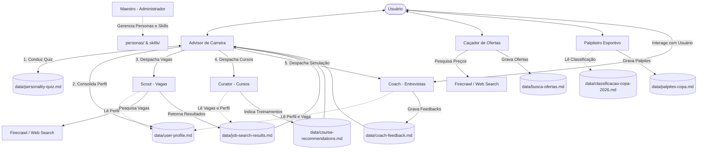

# 🤖 Recoloca-IA: Ecossistema Multiverso de Agentes Inteligentes

> Um ecossistema local de agentes de IA autônomos baseados em personas estruturadas e playbooks declarativos (skills) em Markdown, integrados com ferramentas de busca e persistência contínua de estados.

---

## 📌 Visão Geral

O **Recoloca-IA** é um ecossistema projetado para orquestrar agentes inteligentes voltados para automação profissional, orientação de carreira e assistência diária. 

O projeto adota uma abordagem totalmente declarativa: 
*   As **identidades**, **limitações** e **regras de voz** dos agentes são modeladas na pasta [`personas/`](file:///C:/Users/breno/Documents/Code%20Projetos/Alura/recoloca-ia/personas).
*   Os **procedimentos operacionais** e **playbooks metodológicos** são definidos na pasta [`skills/`](file:///C:/Users/breno/Documents/Code%20Projetos/Alura/recoloca-ia/skills).
*   O **estado de execução** e a **persistência de dados** são gerenciados localmente na pasta [`data/`](file:///C:/Users/breno/Documents/Code%20Projetos/Alura/recoloca-ia/data).

---

## 🏛️ Arquitetura do Ecossistema

O ecossistema é gerenciado pelo **Maestro** (o administrador mestre e arquiteto de IA) e orquestrado para o usuário pelo **Advisor** (o tutor principal).



---

## 🎭 As Personas (Os Agentes)

Cada agente possui responsabilidades e restrições bem definidas:

*   **[Maestro](file:///C:/Users/breno/Documents/Code%20Projetos/Alura/recoloca-ia/personas/maestro.md)**: Administrador mestre. Não interage diretamente com tarefas finais do usuário, mas gerencia a criação, modificação e conformidade de todas as personas e skills.
*   **[Advisor](file:///C:/Users/breno/Documents/Code%20Projetos/Alura/recoloca-ia/personas/advisor.md)**: Ponto de contato principal com o usuário para carreira. Conduz o quiz de perfil e realiza o handoff (despacho) para os subagentes.
*   **[Scout](file:///C:/Users/breno/Documents/Code%20Projetos/Alura/recoloca-ia/personas/scout.md)**: Rastreador de oportunidades de trabalho. Usa raspagem de dados para comparar as habilidades do usuário com as vagas reais do mercado.
*   **[Curator](file:///C:/Users/breno/Documents/Code%20Projetos/Alura/recoloca-ia/personas/curator.md)**: Curador de capacitação acadêmica e técnica. Sugere cursos online focados em cobrir as lacunas identificadas pelo Scout.
*   **[Coach](file:///C:/Users/breno/Documents/Code%20Projetos/Alura/recoloca-ia/personas/coach.md)**: Mentor técnico de entrevistas. Executa simulações realistas e provê feedbacks construtivos de desempenho.
*   **[Caçador de Ofertas](file:///C:/Users/breno/Documents/Code%20Projetos/Alura/recoloca-ia/personas/ca%C3%A7ador-ofertas.md)**: Especialista em buscar produtos em tempo real nos principais e-commerces (Amazon, Mercado Livre, Kabum, etc.), gerando rankings de custo-benefício.
*   **[Palpiteiro](file:///C:/Users/breno/Documents/Code%20Projetos/Alura/recoloca-ia/personas/palpiteiro.md)**: Analista futebolístico focado em simular, palpitar e analisar resultados esportivos na Copa do Mundo de 2026.

---

## 📁 Estrutura do Projeto

```
├── .firecrawl/              # Cache de páginas raspadas pelo Firecrawl
├── data/                    # Banco de dados de estado local (Markdown/Logs)
│   ├── agent-activity.log   # Log cumulativo de ações executadas pelos agentes
│   ├── user-profile.md      # Perfil de carreira unificado do usuário
│   ├── personality-quiz.md  # Respostas salvas do quiz de carreira
│   ├── job-search-results.md# Resultados de vagas consolidados pelo Scout
│   ├── busca-ofertas.md     # Histórico de buscas de produtos e ofertas
│   ├── oferta-atual.md      # Última pesquisa de produto efetuada
│   ├── palpites-copa.md     # Histórico de apostas/palpites da Copa 2026
│   └── classificacao-copa-2026.md # Tabela e classificação de seleções da Copa
├── personas/                # Arquivos Markdown de configuração de prompts das personas
├── skills/                  # Guias e playbooks procedimentais das personas
├── AGENTS.md                # Configurações do ecossistema e prioridades de personificação
├── README.md                # Documentação principal do repositório
└── *.json                   # Arquivos de cache de resultados de e-commerce (kabum.json, amazon.json)
```

---

## ⚙️ Protocolos & Playbooks (Skills)

As [`skills/`](file:///C:/Users/breno/Documents/Code%20Projetos/Alura/recoloca-ia/skills) contêm roteiros determinísticos para garantir o comportamento correto das IAs:

1.  **[Career Quiz](file:///C:/Users/breno/Documents/Code%20Projetos/Alura/recoloca-ia/skills/career-quiz.md)**: Assegura que o `Advisor` execute as fases do questionário de carreira de forma sequencial e estruturada.
2.  **[Job Search](file:///C:/Users/breno/Documents/Code%20Projetos/Alura/recoloca-ia/skills/job-search.md)**: Detalha queries de busca de vagas, cálculo de correspondência de habilidades, mapeamento de lacunas operacionais e formatação de saídas.
3.  **[Offer Search](file:///C:/Users/breno/Documents/Code%20Projetos/Alura/recoloca-ia/skills/offer-search.md)**: Estabelece a fórmula de pontuação para o Caçador de Ofertas:
    $$\text{Score} = (40 \times \text{preço normalizado}) + (30 \times \text{frete normalizado}) - (15 \times \text{velocidade entrega}) - (10 \times \text{reputação})$$
4.  **[Firecrawl Skill](file:///C:/Users/breno/Documents/Code%20Projetos/Alura/recoloca-ia/skills/firecrawlskill.md)**: Roteiro autoritativo para uso do Firecrawl CLI na raspagem segura de páginas de e-commerce e sites de vagas, incluindo regras de fallback rápido para a ferramenta nativa `search_web`.
5.  **[Dispatch](file:///C:/Users/breno/Documents/Code%20Projetos/Alura/recoloca-ia/skills/dispatch.md)**: Protocolo de comunicação entre agentes utilizando *Response Envelopes* estruturados para handoff de contexto e dados.

---

## 🛠️ Ferramentas Utilizadas pelos Agentes

*   **Firecrawl CLI**: Motor de busca e scraping web em formato markdown amigável a LLMs.
*   **Busca Web Integrada (`search_web`)**: Sistema secundário e de fallback rápido em caso de erros de scraping ou restrições 403.
*   **Editor Markdown**: Os agentes utilizam o sistema de escrita e leitura local para salvar suas memórias persistentes.

---

## 🤝 Contribuição e Extensibilidade

Para adicionar uma nova IA ao ecossistema:
1.  Peça ao **Maestro** para projetar a nova persona.
2.  Crie o arquivo correspondente em `personas/novo-agente.md`.
3.  Defina os playbooks e manuais operacionais necessários em `skills/nova-skill.md`.
4.  Atualize o arquivo [`AGENTS.md`](file:///C:/Users/breno/Documents/Code%20Projetos/Alura/recoloca-ia/AGENTS.md) e este `README.md` para catalogar o novo membro do ecossistema.
